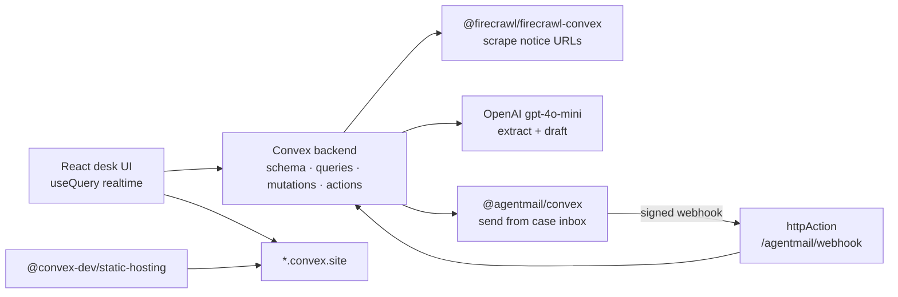

# Northbridge Desk

**Live:** https://necessary-stork-699.convex.site
**Repo:** https://github.com/dl88jing/northbridge-desk
Everyday household mail-ops desk for **Avery & Morgan** / **Northbridge**. Forward landlord, HOA, school, insurance, and contractor mail — Northbridge Desk verifies linked claims with Firecrawl, extracts deadlines with OpenAI, and drafts replies that send from the case inbox via AgentMail. Live on Convex.

## Architecture



## End-to-end demo (under 3 minutes)

1. Open the live app (or `npm run dev` with `npx convex dev`).
2. Click **Demo: ingest sample notices** — seeds rent increase, insurance denial, and school permission cases.
3. Select a case → **Run full pipeline** (Firecrawl scrape → OpenAI extract/draft). Without keys, labeled **demo evidence** / **demo draft** still appear.
4. Edit the draft if you like → **Approve & send**. With AgentMail configured, mail goes from the case inbox; otherwise a demo outbound is logged and status becomes `awaiting_reply`.
5. **Simulate inbound reply** (or wait for the AgentMail webhook) — the timeline updates live via `useQuery`.
6. **Close case** when done. Status path: `new → reviewing → drafting → awaiting_reply → closed`.

## Stack

| Piece | Role |
| --- | --- |
| Convex | Schema, indexes, realtime queries, mutations, actions, scheduler, HTTP webhooks |
| `@firecrawl/firecrawl-convex` | Scrape linked URLs from notices into evidence |
| OpenAI (`OPENAI_API_KEY`) | Extract amounts/deadlines/actions + draft reply (`gpt-4o-mini`) |
| `@agentmail/convex` | Send from the case inbox; inbound webhook appends to timeline |
| `@convex-dev/static-hosting` | Frontend served on `*.convex.site` (hackathon requirement) |

## Environment variables (names only)

Set on the Convex deployment (`npx convex env set NAME value`):

| Name | Purpose |
| --- | --- |
| `OPENAI_API_KEY` | Extraction + drafting |
| `FIRECRAWL_API_KEY` | Live scrapes (use `demo` as a placeholder for demo-only) |
| `FIRECRAWL_WEBHOOK_SECRET` | Optional Firecrawl crawl webhook verification |
| `FIRECRAWL_API_URL` | Optional self-hosted Firecrawl base URL |
| `AGENTMAIL_API_KEY` | Live send |
| `AGENTMAIL_WEBHOOK_SECRET` | Verify `/agentmail/webhook` |
| `AGENTMAIL_BASE_URL` | Optional EU / alternate AgentMail API |
| `AGENTMAIL_DEFAULT_INBOX_ID` | Inbox used as the case inbox for outbound mail |

Frontend:

| Name | Purpose |
| --- | --- |
| `VITE_CONVEX_URL` | Convex client URL (set automatically by `convex dev` / static-hosting deploy) |

**Demo mode:** if provider keys are missing or set to placeholders like `demo`, the UI still runs the full flow with clearly labeled fixture evidence and drafts.

## Local development

```bash
npm install
npx convex dev          # terminal 1 — creates/links deployment, codegen, sets VITE_CONVEX_URL
npm run dev             # terminal 2 — Vite HMR
```

For Firecrawl component env on first deploy, set at least:

```bash
npx convex env set FIRECRAWL_API_KEY demo
```

## Deploy (Convex static hosting)

```bash
npx convex login
npx convex env set FIRECRAWL_API_KEY <key-or-demo>
# optional live keys:
# npx convex env set OPENAI_API_KEY ...
# npx convex env set AGENTMAIL_API_KEY ...
# npx convex env set AGENTMAIL_WEBHOOK_SECRET ...
# npx convex env set AGENTMAIL_DEFAULT_INBOX_ID ...
npm run deploy          # builds frontend + deploys backend + uploads to *.convex.site
```

Register the AgentMail webhook URL:

`https://<your-deployment>.convex.site/agentmail/webhook`

**Live app:** https://necessary-stork-699.convex.site

## Repo

https://github.com/dl88jing/northbridge-desk
